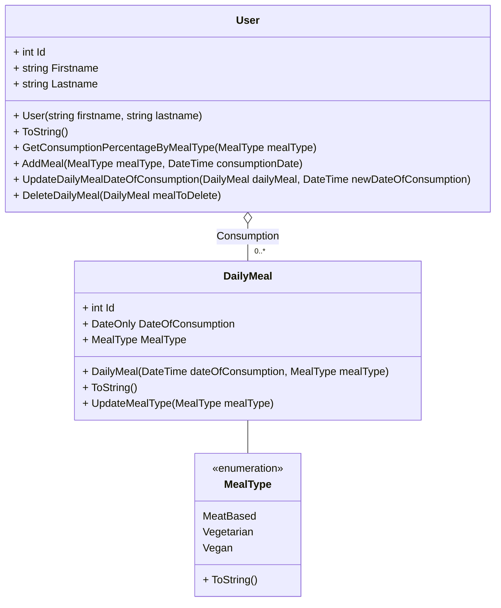

# Solution class diagram

```mermaid
classDiagram
    User o-- "0..*" DailyMeal : Consumption
    DailyMeal -- MealType

    class User {
        + int Id
        + string Firstname
        + string Lastname
        + User(string firstname, string lastname)
        + ToString()
        + GetConsumptionPercentageByMealType(MealType mealType)
        + AddMeal(MealType mealType, DateTime consumptionDate)
        + UpdateDailyMealDateOfConsumption(DailyMeal dailyMeal, DateTime newDateOfConsumption)
        + DeleteDailyMeal(DailyMeal mealToDelete)
    }
    class DailyMeal {
        + int Id
        + DateOnly DateOfConsumption
        + MealType MealType
        + DailyMeal(DateTime dateOfConsumption, MealType mealType)
        + ToString()
        + UpdateMealType(MealType mealType)
    }
    class MealType{
        <<enumeration>>
        MeatBased
        Vegetarian
        Vegan
        + ToString()
    }
```
